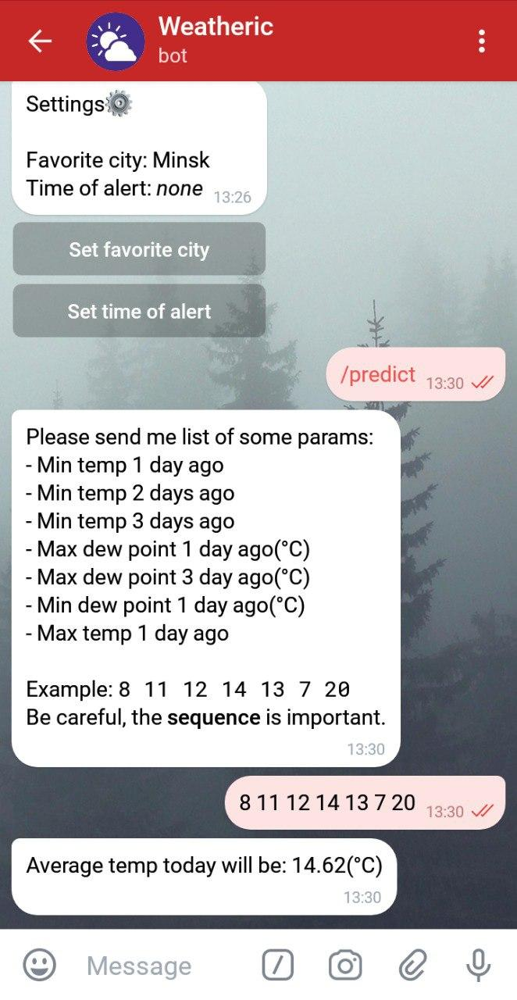

# Weatheric

Telegram bot that provide weather forecast by geolocation or city name.  
  

  

    
  
  
  
## Review  
  
Weather information is supplied by [OpenWeatherMap](https://openweathermap.org/).  
Bot based on a polling (not webhook) using [python-telegram-bot](https://github.com/python-telegram-bot/python-telegram-bot) library.  
  
  
## Features
- Current weather and forecasts in your city.
- Fully usable with buttons - no need to enter city(geolocation) everytime.
- Notifies you about the current at the specified time.
- Supports weather prediction by some params (model based on Linear Regression).

## Project stucture
 - `conversation_handler` package contains answers for different conversation brunches (Read [conversaion handler](https://python-telegram-bot.readthedocs.io/en/stable/telegram.ext.conversationhandler.html)).
 - `service` package contains some utils, the main ones are:
   - `alert_service` - sends alerts using telegram bot api.
   - `db_service` - works with mongo atlas(saves favourite user cities and time for alerts) 
   - `predictor_service`- returns weather prediction by params list
   - `weather_service` - works with openweathermap
 - `main.py` - launches all services
 
## Screenshots

  <h3>Favorite city</h3>
  

    

  <h3>Forecast periods</h3>
  

    

  <h3>Settings</h3>
  

    

  <h3>Weather prediction</h3>
  

    

## TODO
- [ ] Fix some problems with db
- [ ] Add more forecast periods
- [ ] Something else :)

## P.S.
All tokens are invalid :D